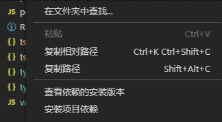
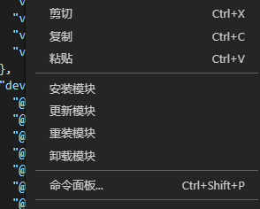

# npm-module-helper

### 功能说明
1. 查看项目依赖的安装版本
2. npm 安装项目依赖
3. 安装/卸载模块

### 效果预览
1. 文件资源管理器  
  
2. package.json  

### 使用说明
1. 选择文件夹或 package.json 文件
2. 鼠标右键打开右键菜单
3. 选择菜单项

### 其它说明
| 版本 | 说明 |
--|--
| 0.1.0 | cnpm 换为 npm 
| 0.0.9 | 考虑到查看 项目依赖的安装版本 时可能需要文件对比, 添加了一个diff插件(Diff Tool), 如不需要, 可在插件管理中禁用

### 参考插件
[create-react-component](https://github.com/tobi12345/create-react-component)

### LICENSE
MIT
